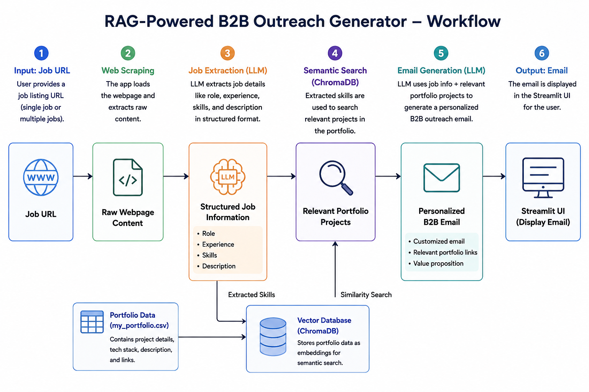
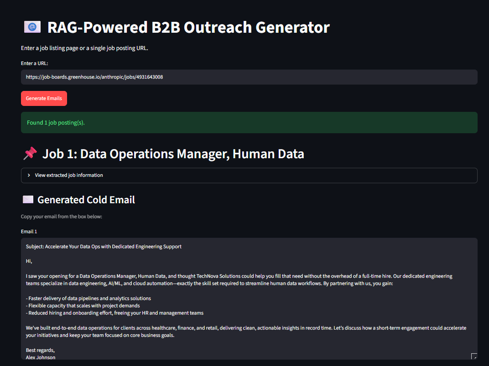

# 🚀 RAG-Powered B2B Outreach Generator

An AI-powered application that automatically extracts job information from a job posting and generates a personalized B2B outreach email using **Generative AI, RAG, embeddings, and semantic search**.

🔗 **Live Demo:**  
https://rag-powered-b2b-outreach-generator-ekmy58wtishtuvpnysmwju.streamlit.app/

🔗 **GitHub:**  
https://github.com/Ritu1331/rag-powered-b2b-outreach-generator

---

## 📌 Project Overview

Finding a job opportunity is easy, but writing a personalized outreach email for every opportunity is time-consuming.

A person normally needs to:

- Read the job description
- Understand the required skills
- Find relevant projects from their portfolio
- Connect their experience with the job requirements
- Write a personalized email

This project automates this entire process.

The user provides a **job posting URL**, and the application:

1. Extracts the webpage content
2. Identifies important job information
3. Extracts the required skills and experience
4. Searches the portfolio for relevant projects
5. Uses the retrieved projects as context
6. Generates a personalized outreach email

---

# 🎯 Problem Statement

Traditional B2B outreach is often:

- Time-consuming
- Repetitive
- Difficult to personalize
- Difficult to scale
- Prone to irrelevant project recommendations

For example, if a company is hiring for a Machine Learning Engineer, the outreach email should ideally mention projects related to:

- Python
- Machine Learning
- NLP
- LLMs
- Generative AI

Manually identifying these projects for every job posting takes significant time.

### Goal

Build an AI system that automatically connects:

**Job Requirements → Relevant Portfolio → Personalized Outreach**

---

# 💡 Solution

The application combines **Web Scraping, LLMs, RAG, Embeddings, Vector Search, and Generative AI**.

The complete workflow is:

```text
             Job Posting URL
                    │
                    ▼
           Webpage Extraction
                    │
                    ▼
             Job Information
                    │
                    ▼
             LLM Processing
                    │
                    ▼
        Job Role + Skills + Requirements
                    │
                    ▼
             Semantic Search
                    │
                    ▼
               ChromaDB
                    │
                    ▼
        Relevant Portfolio Projects
                    │
                    ▼
             LLM + Context
                    │
                    ▼
       Personalized Outreach Email
```

---

# 🏗️ System Architecture



The application consists of several major components.

### 1. User Interface

The application uses **Streamlit** to provide a simple web interface.

The user enters a job URL and starts the processing pipeline.

---

### 2. Web Data Extraction

The job webpage is loaded using LangChain's `WebBaseLoader`.

The webpage content is converted into text so that the LLM can process it.

```text
Job Website
     ↓
HTML Content
     ↓
WebBaseLoader
     ↓
Extracted Text
```

---

### 3. Job Information Extraction

The extracted webpage content is passed to the LLM.

The model identifies information such as:

```text
Role
Experience
Skills
Job Description
```

For example:

```json
{
  "role": "Machine Learning Engineer",
  "experience": "2+ years",
  "skills": [
    "Python",
    "Machine Learning",
    "NLP",
    "LLMs"
  ]
}
```

This structured information is then used for portfolio retrieval.

---

# 🧠 RAG Implementation

RAG stands for:

> **Retrieval-Augmented Generation**

RAG is used in this project to find portfolio projects that are relevant to the job before generating the email.

The process is:

```text
Job Requirements
       ↓
Create/Search Semantic Representation
       ↓
Vector Database
       ↓
Retrieve Relevant Projects
       ↓
Send Retrieved Context to LLM
       ↓
Generate Email
```

Instead of providing the entire portfolio to the LLM, the application retrieves only the most relevant projects.

This helps the generated email stay focused on the specific job.

---

# 🔎 Semantic Search

The portfolio contains information about different projects and their technologies.

The project information is converted into **embeddings**.

An embedding represents text as a numerical vector.

For example:

```text
"Machine Learning + NLP + LLM"
             ↓
        Embedding
             ↓
     Numerical Vector
```

The vectors are stored in **ChromaDB**.

When a job is processed, the system searches for portfolio projects whose meaning is closest to the job requirements.

This is called **semantic similarity search**.

---

# 🗄️ ChromaDB

**ChromaDB** is used as the vector database.

Its purpose is to store portfolio embeddings and perform similarity searches.

For example:

```text
Job Requirements:

Python
NLP
LLM
RAG

        ↓

      ChromaDB

        ↓

Relevant Projects:

Medical Chatbot
RAG Application
NLP Project
```

The retrieved projects are then passed to the LLM.

---

# 🤖 Generative AI

Generative AI is responsible for creating new content based on the information provided to it.

In this project, the LLM is used for two important tasks.

### Job Analysis

The LLM understands the extracted webpage and identifies the important job requirements.

### Email Generation

The LLM uses:

- Job role
- Skills
- Job requirements
- Relevant portfolio projects

to generate a personalized outreach email.

Therefore:

```text
Retrieved Information
        +
Job Requirements
        +
Portfolio Context
        ↓
       LLM
        ↓
Personalized Email
```

---

# ✉️ Example Workflow

Suppose a job posting requires:

```text
Python
Machine Learning
NLP
LLMs
```

The system searches the portfolio and finds relevant projects such as:

```text
Medical Chatbot
RAG Application
NLP Project
```

The LLM then uses these projects while generating the outreach email.

Example:

```text
Subject: AI/ML Solutions for Your Team

Hi,

I came across your Machine Learning Engineer opening and
noticed that the role focuses on Python, NLP and LLM-based
applications.

I have worked on machine learning and RAG-based projects,
including a medical chatbot involving NLP and
retrieval-augmented generation.

I would love to explore how my experience could contribute
to your team.

Best regards,
Ritu
```

---

# ✨ Key Features

- 🌐 Job webpage extraction
- 🤖 AI-powered job analysis
- 🔎 Semantic portfolio search
- 🧠 Retrieval-Augmented Generation
- 🗄️ ChromaDB vector database
- ✉️ Personalized outreach email generation
- 📋 Structured job information extraction
- 🔄 Single and multiple job processing
- 🎨 Streamlit interface
- ☁️ Streamlit Cloud deployment

---

# 🛠️ Technologies Used

| Technology | Purpose |
|---|---|
| Python | Core programming language |
| Streamlit | Web interface |
| LangChain | LLM application framework |
| LangChain Community | Web page loading |
| LangChain Groq | Groq LLM integration |
| Groq | Fast LLM inference |
| ChromaDB | Vector database |
| Embeddings | Semantic representation and search |
| Pandas | Data processing |
| BeautifulSoup | Web content processing |
| Git | Version control |
| GitHub | Code hosting |
| Streamlit Cloud | Deployment |

---

# 🔄 Complete Working

The complete application works in the following sequence:

### Step 1 — Enter Job URL

The user enters a job posting URL.

### Step 2 — Extract Webpage

The application loads the webpage and extracts its text.

### Step 3 — Understand Job

The LLM identifies:

- Job title
- Skills
- Experience
- Requirements
- Description

### Step 4 — Search Portfolio

The job requirements are used to search the portfolio using semantic similarity.

### Step 5 — Retrieve Relevant Projects

ChromaDB returns the most relevant portfolio projects.

### Step 6 — Generate Email

The LLM receives the job information and retrieved projects.

### Step 7 — Display Result

The personalized outreach email is displayed in the Streamlit interface.

---

# 🐛 Challenges Faced & Solutions

## 1. Different Job Website Structures

Different companies use different career platforms and webpage structures.

A method that works perfectly on one website may not work on another.

### Solution

The project uses a generic webpage loader combined with LLM-based interpretation of the extracted content.

---

## 2. Multiple Jobs on One Page

Some company career pages contain many job postings.

Sending an extremely large page to the LLM can result in:

- Large responses
- Invalid JSON
- Incomplete extraction
- Token limitations

### Solution

The application limits the number of jobs processed in a request and handles single-job and multiple-job extraction separately.

---

## 3. Invalid LLM JSON

During development, the LLM sometimes returned incomplete or invalid JSON when processing large job pages.

Example:

```text
LLM returned invalid JSON
```

### Solution

The extraction pipeline was improved using:

- Structured prompts
- Response validation
- Retry handling
- Limited job extraction
- Separate handling for single and multiple jobs

---

## 4. Missing Dependency During Deployment

During deployment, Streamlit initially showed:

```text
ModuleNotFoundError:
No module named 'langchain_community'
```

The application worked locally because the required package existed in the local environment.

### Solution

The missing dependency was added to `requirements.txt`.

After pushing the updated requirements to GitHub, Streamlit Cloud installed the dependency during deployment.

---

## 5. GitHub Secret Protection

GitHub detected a Groq API key inside notebook files and blocked the push.

### Solution

The files containing the exposed API key were removed before pushing the repository.

The project uses environment variables for API keys instead of hardcoding secrets.

> API keys should never be committed to a public GitHub repository.

---

# 💻 How to Run Locally

## 1. Clone the Repository

```bash
git clone https://github.com/Ritu1331/rag-powered-b2b-outreach-generator.git
```

---

## 2. Go to the Project

```bash
cd rag-powered-b2b-outreach-generator
```

---

## 3. Create Virtual Environment

```bash
python -m venv .venv
```

---

## 4. Activate Virtual Environment

### Windows PowerShell

```powershell
.venv\Scripts\Activate.ps1
```

### Windows Git Bash

```bash
source .venv/Scripts/activate
```

After activation:

```text
(.venv)
```

should appear in the terminal.

---

## 5. Install Dependencies

```bash
pip install -r requirements.txt
```

---

# 🔐 Configure API Key

Create a `.env` file in the project directory.

Add:

```env
GROQ_API_KEY=your_groq_api_key
```

Replace:

```text
your_groq_api_key
```

with your actual Groq API key.

### ⚠️ Important

Never upload the `.env` file or your API key to GitHub.

---

# ▶️ Start the Application

Run:

```bash
streamlit run app/main.py
```

The terminal will show something similar to:

```text
Local URL: http://localhost:8501
```

Open:

```text
http://localhost:8501
```

in your browser.

---

# ☁️ Deployment

The application is deployed using **Streamlit Community Cloud**.

Deployment flow:

```text
GitHub
   ↓
Streamlit Community Cloud
   ↓
Install requirements
   ↓
Configure API Secret
   ↓
Run Streamlit Application
   ↓
Live Web Application
```

### Live Demo

https://rag-powered-b2b-outreach-generator-ekmy58wtishtuvpnysmwju.streamlit.app/

---

# 📸 Screenshots

## Application



## Architecture


---

# ⚠️ Limitations

The application depends on publicly accessible job webpages.

Some websites may:

- Block automated requests
- Require JavaScript
- Require authentication
- Use anti-bot systems
- Dynamically load job information

Because of this, job extraction may not work perfectly for every website.

---

# 🔮 Future Improvements

Possible improvements include:

- Better support for different job platforms
- Website-specific extraction
- Improved structured output
- Hybrid keyword + semantic search
- Better portfolio matching
- Company research
- Hiring manager identification
- Gmail/Outlook integration
- Automated email sending
- Retrieval evaluation
- Email quality evaluation

---

# 🎓 Key Learnings

Through this project, I worked with:

- Python
- Streamlit
- LangChain
- LLMs
- Generative AI
- Prompt Engineering
- RAG
- Embeddings
- Vector Databases
- ChromaDB
- Semantic Search
- Web Data Extraction
- API Integration
- JSON Processing
- Error Handling
- Environment Variables
- Git & GitHub
- Cloud Deployment

---

# ⭐ Conclusion

The **RAG-Powered B2B Outreach Generator** combines web extraction, semantic search, RAG, and Generative AI to automate personalized B2B outreach.

Instead of manually reading a job posting and searching through a portfolio, the system automatically:

```text
Job URL
   ↓
Extract Job Information
   ↓
Understand Requirements
   ↓
Retrieve Relevant Portfolio
   ↓
Generate Personalized Email
```

This demonstrates how **LLMs + RAG + Vector Databases** can be combined to build a practical AI application.

---

# 👨‍💻 Author

**Ritu**

GitHub:  
https://github.com/Ritu1331

Project:  
https://github.com/Ritu1331/rag-powered-b2b-outreach-generator

Live Demo:  
https://rag-powered-b2b-outreach-generator-ekmy58wtishtuvpnysmwju.streamlit.app/

⭐ If you find this project useful, consider giving the repository a star!
